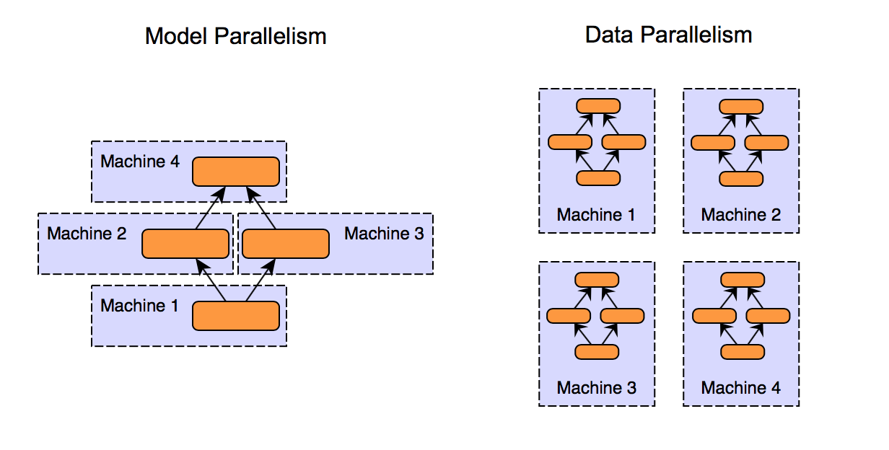

# 15-418 Final Project Proposal
**Manish Nagireddy (mnagired) and Ziad Khattab (zkhattab)**

# Title

An Exploration of Parallelism in Neural Networks

# Summary

For our 15-418 final project, we are looking into potential axes of parallelism that exist within neural networks. We will be implementing neural
networks in `Python` (via `PyTorch` and `mpi4py`, an `MPI` package for `Python`) as well as potentially also via `MPI` in `C++` and measuring their
performance on CPUs as well as GPUs.

# Background

In recent years, we have seen the rapid increase of neural networks
within the landscape of artificial intelligence, and more broadly within
algorithmic decision making. However, because of the large size of these
models (given by the number of parameters) as well as the large size of
the data used to train them, performance of these so-called deep
learning paradigms can be suboptimal without specific attention to
parallelism.

Broadly, from the perspective of a neural network, there are two
dimensions to parallelize: the data and the model.

1.  **Data Parallelism:**

    -   given X machines/cores, split the data into X partitions and
        use the *same* model to train each partition of the data on a
        different device in parallel. Then, combine the resultant model
        weights from each partition

    -   Note that this is model agnostic because it relies only on the
        data

2.  **Model Parallelism:**

    -   splitting the model into various partitions and assigning them
        to different machines.

    -   NOTE: there are dependencies that are specific to specific model
        architectures, and so model parallelism is not really
        "parallel\" because we are actually just assigning consecutive
        layers of a model to different devices. Some have referred to
        this as *model serialization*[^1]

    -   commonly used when the model is too large to fit on a single
        device

Refer to the figure[^2] below for an illustration of data parallelism
and model parallelism.

# The Challenge 

The main challenge stems from the fact that there exist a lot of
dependencies when working with a neural network. At the lowest,
implementation-detail level, we know that different architectures have
different structures and therefore different dependencies between layers
(e.g. between input and hidden layers). But we also know that the choice
of hyperparameters (e.g. learning rate) and optimizers (e.g. Stochastic
Gradient Descent or SGD, Adam, AdaGrad, etc.) heavily influence model
convergence time as well as model performance. In addition, we have that
the choice of dataset is also significant (and related) to the class of
models we use. Finally, we are limited by the choice of compute power,
in the sense that we can only measure performance on machines with fixed
number of CPU cores as well as fixed numbers of GPUs.

Given that we want to focus on parallelism, we do *not* want to get
caught up in trying out different models on different datasets with
different parameters. Thus, we will fix our dataset to be the widely
well-known benchmark MNIST[^3] dataset. This also restricts us to the
problem of image classification, where further restricts the class of
neural networks that we will be looking at (e.g. now we can focus on
simple feed forward networks and basic convolutional neural networks or
CNNs). From background research, this dataset is known to be relatively
cheap to train and still have nontrivial results without excessive
preprocessing of the input data.

Then, we're able to focus the "unknown\" aspects of our project to be
the axes of parallelism and their corresponding performance or speedups.
Specifically, once we have a baseline performance in a shared memory
setting, we can transition and aim to look at the difference between
data and model parallelism, as well as the specific differences within
data parallelism (e.g. multi core vs single GPU vs multi GPU).

To make this more concrete, here is the high level sequence of our
project:

1. Implement a basic feed forward model in `PyTorch` to serve as a reference for speedup and general performance

2. Implement a message-passing model with convolutional neural net base in `mpi4py`

3. (Optional / Time Permits) Add additional `PyTorch` models with varying architectures (e.g. `ResNet`)

4. Start experiments comparing both basic and complicated models via data and model parallelism

    -   For data parallelism: experiment with different batch sizes
        (explained below)

    -   For model parallelism: experiment with models on multi core vs
        single GPU vs multi GPU
        
5. (Optional / Time Permits) Add `C++` implementation with `MPI` and add to above experiments

  

# Resources

Given that we want to explore the differences in axes of parallelism, we will try not to spend too much time implementing sequential neural networks
from scratch. For `Python`, we will rely upon the `PyTorch` documentation for commonly used neural networks (e.g. standard CNN or basic `ResNet`). *The
main coding portion (in* `Python + mpi4py`) *will come from incorporating message passing into a* `PyTorch` *based model*

Additionally, there is a very interesting article from folks at Google
Research[^4] which describes the various scaling patterns that they
observed during data parallelism. Note that their measurement of data
parallelism is directly related to the batch size, which is the number
of training data examples utilized in one iteration of training the
model. Specifically, they discovered three distinct but related
so-called "scaling-regimes\":

1.  Perfect Scaling: doubling batch size halves number of training steps
    to reach some target error

2.  Diminishing Returns: fewer decreases to training time with
    increasing batch size

3.  Maximal Data Parallelism: further increasing batch size beyond this
    point doesn't reduce training time

We will attempt to see if this pattern can also be observed with our
model and comment on any differences. Note that this will only be
possible for the `Python` models due to the features provided by
`PyTorch`

Finally, regarding the computing resources required for our project, we
will use the following:

-   For Single GPU: we will use AWS EC2 `g4dn.xlarge` which comes with 1
    GPU. One of the team members has around \$45 in credits from a
    previous deep learning course so we should hopefully not need any
    more than this

-   For Multi-GPUs (to be used only in model parallelism): we will use
    the PSC-Bridges 2 machines which have either 8 or 16 GPUs

-   For Multi-Core: we will either use the Gates machines for lower core
    counts, or talk to the professors about getting access to higher
    core count machines (e.g. 32 or 64 cores).

# Goals and Deliverables

#### PLAN TO ACHIEVE

A successful project would entail a comparison between data and model parallelism with respect to speedup as well as performance. This would involve
having a working implementation of our models in `PyTorch` as well as using `mpi4py` to be able to comment on performance and speedup in a message
passing paradigm. With these models, we will have measurements of speedup with respect to both data and model parallelism. For an example of a specific
metric we may want to look out for, we will see if we can achieve the result that doubling batch size (so in the data parallel setting) halves the
training time.

#### HOPE TO ACHIEVE

If everything is going very well and we are able to get all of these measurements, we will experiment with also adding other types of neural network
architectures (e.g. `ResNet`) as well as possibly trying to implement the simple network in `C++` with and without `MPI`.

#### 75%

If everything is going slower than intended, then we will pick only one
of data or model parallelism to proceed forward with, depedending on
what seems more suitable given our resource and time constraints.

#### Poster Session Demo

Ideally, we would like to be able to run an iteration of our model
training and output a classification, across the different model types.
Realistically, this may not be feasible given the resources we need
(e.g. we may not be able to have a 16 GPU machine on standby) and so we
will try to at least show multi-core (via AWS or GHC) at the minimum. We
will also definitely show our speedup and performance graphs.

#### Learning Objectives

Our learning objectives are as follows:

-   Think about the inherent dependencies within a deep learning
    pipeline when attempting to implement a neural network via shared
    memory

-   Comment on the effectiveness of data and/or model parallelism in the
    example of a reasonably complex data and model setting

# Platform Choice

Given that the majority of this class is focused on parallelism, we want to incorporate one of the main kinds of parallel settings that we have talked
about. Specifically, in the context of neural network training, it makes sense to use message passing where we can distribute the training across
processors. We will have each processor train a copy of the network and then send back the updated weights. Then, we average the weights together
continue with validation and testing.

As for compute resources, we will be using a combination of AWS EC2,
PSC-Bridges 2, GHC cluster machines, and potentially other high core
machines from professors to be able to satisfy our different
requirements.

# Schedule

| Week      | Goals |
| ----------- | ----------- |
| 3/21 - 3/28 | Project proposal and start working on `PyTorch` implementation of basic network       |
| 3/28 - 4/04 | Finish the `PyTorch` basic model and start translating to `mpi4py` implementation        |
| 4/04 - 4/11 | Finish the `mpi4py` implementation + Milestone Report and start data parallelism in Python        |
| 4/11 - 4/18 | Finish Data Parallelism and start working on Model Parallelism        |
| 4/18 - 4/25 | Finish Model Parallelism + start collecting performance metrics, maybe work on `ResNet` model architecture        |
| 4/25 - 4/29 | Finish Final Report         |

[^1]: [Data Parallelism VS Model Parallelism in Distributed Deep
    Learning Training - Lei Mao's Log
    Book](https://leimao.github.io/blog/Data-Parallelism-vs-Model-Paralelism/)

[^2]: [Link to Figure
    Citation](https://xiandong79.github.io/Intro-Distributed-Deep-Learning)

[^3]: [Link to MNIST Data](http://yann.lecun.com/exdb/mnist/)

[^4]: [Measuring the Limits of Data Parallel Training for Neural
    Networks](https://ai.googleblog.com/2019/03/measuring-limits-of-data-parallel.html)
