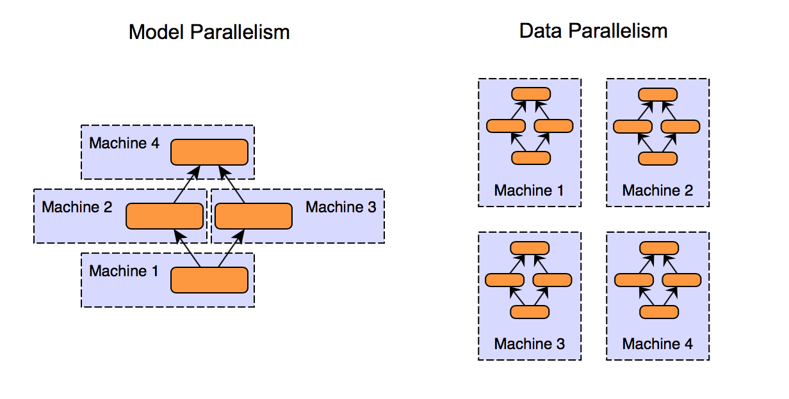

::: center
15-418 Final Project Report\
**Manish Nagireddy (mnagired) and Ziad Khattab (zkhattab)**\
:::

# Title {#title .unnumbered}

An Exploration of Parallelism in Neural Networks

# Summary

For our 15-418 final project, we looked into potential axes of
parallelism that exist within neural networks. We implemented image
classifying neural networks in `Python` (via `PyTorch` and `mpi4py`, a
message passing package for Python) as well as also via `OpenMP` in
`C++` and measured their performance (e.g. test set accuracy and
training time). We found that data parallelism through varying batch
size is far more robust (as well as more effective) than attempting to
map neural network training to either a shared memory or message passing
setting.

# Note

Below, we have our entire final report and findings. 

# Background

In recent years, we have seen the rapid increase of neural networks
within the landscape of artificial intelligence, and more broadly within
algorithmic decision making. However, because of the large size of these
models (as defined by the number of parameters) as well as the large
size of the data used to train them, performance of these so-called deep
learning paradigms might be suboptimal without specific attention to
parallelism.

Broadly, from the perspective of a neural network, there are two
dimensions to parallelize: the data and the model.

#### Data Parallelism

given $X$ machines/cores, we split the data into $X$ partitions and use
the *same* model to train each partition of the data on a different
device in parallel. Then, we combine the resultant model weights from
each partition. Note that this is *model agnostic* because it relies
only on the data and not on the underlying model architecture.

#### Model Parallelism

splitting the model into various partitions and assigning them to
different machines. Note that there are dependencies which are specific
to specific model architectures, and so model parallelism is not really
"parallel\" because we are actually just assigning consecutive layers of
a model to different devices. Some have referred to this as *model
serialization*[^1]. Model parallelism is commonly used when the model is
too large to fit on a single device.\
Refer to the figure[^2] below for an illustration of data parallelism
and model parallelism.

## Breaking it Down

The main challenge stems from the fact that there exist a lot of
dependencies when working with a neural network. At the lowest,
implementation-detail level, we know that different architectures have
different structures and therefore different dependencies between layers
(e.g. between input and hidden layers). But we also know that the choice
of hyperparameters (e.g. learning rate) and optimizers (e.g. Stochastic
Gradient Descent or SGD, Adam, AdaGrad, etc.) heavily influence model
convergence time as well as model performance. In addition, we have that
the choice of dataset is also significant (and related) to the class of
models we use. Finally, we are limited by the choice of compute power,
in the sense that we can only measure performance on machines with fixed
number of CPU cores as well as fixed numbers of GPUs.

Given that we want to focus on parallelism, we did *not* want to get
caught up in trying out different models on different datasets with
different parameters. Thus, we fixed our dataset to be the widely
well-known benchmark MNIST[^3] dataset. This also limited us to the
problem of image classification, which further restricted the class of
neural networks that we looked at (e.g. now we focused on simple feed
forward networks and basic convolutional neural networks or CNNs). From
background research, this dataset is known to be relatively cheap to
train and still have nontrivial results without excessive preprocessing
of the input data. Finally, we decided to hold several commonly used
hyperparameters constant. For example, our choice of loss criterion was
cross entropy loss, our choice of optimizer was stochastic gradient
descent (SGD). So, we fixed these values and varied other
hyperparameters, such as the learning rate of the optimizer, the number
of training iterations (i.e. epochs), and the batch size. Of course, we
also varied the number of processors (in the context of message passing)
as well as the number of threads (for shared memory).

Then, we were able to focus the "unknown\" aspects of our project to be
the axes of parallelism and their corresponding performance or speedups.
Specifically, once we had a baseline working model in `PyTorch`, we were
able to incorporate message passing and then we were even able to
implement a shared memory version in `C++` via `OpenMP`.

Given that the majority of this class is focused on parallelism, we want
to incorporate one of the main kinds of parallel settings that we have
talked about. Specifically, in the context of neural network training,
it makes sense to use message passing where we can distribute the
training across processors. We will have each processor train a copy of
the network and then send back the updated weights to a master process.
Then, we average the weights together and continue with validating our
model via evaluation on a held-out testing set of images.\
At a high level, our learning objectives were to

1.  Think about the inherent dependencies within a deep learning
    pipeline when attempting to implement a neural network via message
    passing (and possibly also via shared memory)

2.  Comment on the effectiveness (i.e. speedup and overall performance)
    of data parallelism in the example of a reasonably complex data and
    model setting

## Changes Along the Way

#### Dropping `C++` (for now)

We note that our project changed immediately following our proposal
feedback. For the time being, we decided to drop the `C++` and `OpenMP`
implementation entirely due to potential time constraints. Then, we
changed our project to have the core of the parallelism implementation
have to do with `mpi4py` since we were able to more easily justify how
message passing can be leveraged in neural network training (see above).

#### Dropping Model Parallelism in favor of Message Passing + More Complex Architectures

Then, after a week or so, when we finished the `MPI` based
implementations of a feedforward multi-layer perceptron (MLP) as well as
a basic convolutional neural network (CNN), we decided that the
implementation of model parallelism is not rigorous enough to justify
the time spent attempting to gather the resources to test model parallel
workflows. Specifically, given `PyTorch` and its capabilities, the way
to implement model parallelism would be to send different layers of a
network architecture to different machines (e.g. different GPUs). Then,
in order to test this model, we would have to secure multi-GPU machines,
which would take more work than the actual implementation of model
parallelism itself.

Therefore, to account for this change, we decided to translate our
message-passing based parallelism to a more sophisticated neural network
architecture, such as `ResNet`. More concretely, given that the internal
architecture of `ResNet` is inherently more complicated than a 2-layer
CNN (which we have already implemented), we anticipated that attempting
to integrate message passing (again via `mpi4py`) will be more
complicated with respect to implementation. Additionally, we would be
able to compare the effectiveness of message passing effects on baseline
models against more complicated architectures. This added dimension of
comparision, as well as the increase in complexity of implementation,
allowed us to justify the change in plans. As we describe later in the
results section, the addition of message passing to a more sophisticated
model architecture yielded some surprising performance metrics.

#### The Return of `C++` 

Finally, with about a week to go before the project deadline, we decided
to go for our \"Hope to Achieve\" goals where we wanted to experiment
with moving to `C++` and potentially also incorporating a shared memory
setting via `OpenMP`. Although it was certainly nontrivial to mesh our
idea of data parallelism within the shared memory paradigm, we were able
to achieve a successful implementation with decent speedup after
thinking carefully about synchronization. We elaborate more on our
approach below and on our results further below.

# Approach

Our approach, in a broad sense, was data-side parallelization of the
neural network training process. We did this by partitioning the data
across threads, so that different processors are training the neural
network architecture from their own randomized starting points, then
either using a reductive combination process across all the weights
trained by each processor to unify them (in the message passing case) or
using synchronization to update a shared copy of these weights (shared
memory).

In both the message passing and shared memory settings, we aimed to map
a portion of the training data in a given epoch to a processor core.
This was the primary basis of parallelism in our codebase.

Given that we want to explore the differences in axes of parallelism, we
tried to not spend too much time implementing sequential neural networks
from scratch. For `Python`, we will rely upon the `PyTorch`
documentation for commonly used neural networks (e.g. standard CNN or
basic `ResNet`). The main coding portion (in `Python + mpi4py`) will
come from incorporating message passing into a `PyTorch` based model.

#### Message Passing

The `Python` portion of the code included two networks, a simple
Convolutional Neural Network (CNN), and a more complicated CNN with
underlying `ResNet`[^4] architecture. In these two cases, the
parallelization was done in a nearly identical way: we had a master
process that would send a copy to each worker and then use `MPI` to
broadcast a message to the workers to begin training. The workers would
run their training loops and send their state dictionaries (which
contained the updated weight parameters for each corresponding model)
back to the master to be combined with one another for the next epoch
(i.e. next iteration of the training loop). Since we were concerned with
parallelization rather than machine learning, we first coded up a simple
neural network without any message passing in `PyTorch` (referring to
their documentation for both CNN's and `ResNet`) to serve as a
sequential basis for our code.

There were slight changes to the serial algorithm, in that we had to
employ a reductive combination on the weights after the distributed
training. This is slightly different from a purely sequential neural
network where each input updates the weights cumulatively. We observed
some tradeoffs because of this, which we discuss below in our results
section.

Optimization mainly occurred in two passes: the initial parallelization,
and then the later efforts to make it more efficient. Initially, we used
a roundtrip system in `MPI` to pass the weights on, hoping to emulate
the structure of a sequential neural network. Then, the main
optimization involved using broadcasting to make the master-worker
architecture more efficient, instead of using the aforementioned
roundtrip system.

#### Shared Memory

The `C++` portion only used a simple feedforward multi-layer perceptron,
but instead used `OpenMP` to parallelize the training process. The
principle was similar, except that there was no need to separate things
into master and worker processes because `OpenMP` allows for automatic
work distribution across threads. We note that from the `C++`
standpoint, there exists an abundance of starter code for basic neural
networks (e.g.
[\[1\]](https://github.com/Whiax/NeuralNetworkCpp/tree/master/src/neural),
[\[2\]](https://github.com/huangzehao/SimpleNeuralNetwork/blob/master/src/neural-net.cpp),
[\[3\]](https://github.com/arnobastenhof/mnist/tree/master/src)). So,
once we had a working sequential neural network, we spent an
overwhelming majority of the time trying to adapt this implementation
into a shared memory setting.

In `OpenMP`, we used a similar structure to what we have now, but had
very conservative lock-based synchronization to ensure correctness,
since we did not have the message-passing abstraction to keep things
clean and were instead updating weights in shared memory.

We made optimizations by limiting synchronization and minimizing
critical sections as much as possible (so much so that in fact we were
able to reduce them to two lines in the training loop). Another major
breakthrough for us was to make the "memory windows\" used for
intermediate weight calculations *private* to the threads instead of
shared, and this allowed us to reduce synchronization significantly.
This did seem to come with overall memory tradeoffs which we will
discuss later in our results section.

# Results

At a high level, we were successful in achieving our main goal - to have
a working implementation of our models in a message passing setting so
that we will be able to comment on performance and speedup.
Additionally, we were even able to achieve one of our extra credit
options where we were able to implement a simple feedforward
convolutional neural network in `C++` and combine this with our
knowledge of shared memory via `OpenMP`.

## Related Work

Before we get into our specific results, we'd like to note that there is
a very interesting article from folks at Google Research[^5] which
describes the various scaling patterns that they observed during data
parallelism. Note that their measurement of data parallelism is directly
related to the batch size, which is the number of training data examples
utilized in one iteration of training the model. Specifically, they
discovered three distinct but related so-called "scaling-regimes\":

1.  Perfect Scaling: doubling batch size halves number of training steps
    to reach some target error

2.  Diminishing Returns: fewer decreases to training time with
    increasing batch size

3.  Maximal Data Parallelism: further increasing batch size beyond this
    point doesn't reduce training time

See the figure above for a visual depication of these regimes.
Specifically, the Google researchers found a universal relationship
between batch size and training speed with three distinct regimes:
perfect scaling (following the dashed line), diminishing returns
(diverging from the dashed line), and maximal data parallelism (where
the trend plateaus). The transition points between the regimes vary
dramatically between different workloads[^6]. We attempted to see if
this pattern could also be observed with our model and comment on any
differences below in our results section. Note that the Google
researchers use training steps, whereas we utilize training time (given
by the number of seconds needed to fully complete one epoch of
training). This is a simplification for clarity, but one which does not
impact correctness since training time and number of training steps are
very closely related.

## Summary of Findings

For a quick summary of our findings, we were able to observe similar
results as the Google researchers, even in the context of message
passing. Specifically, we observed that increasing the batch size
resulted in decreasing the training time, but not in a linear fashion.
We did, in fact, observe the "diminishing returns\" noted above.
Furthermore, we found that increasing the batch size also resulted in
lower testing accuracy, which means that our model became poorer at
generalizing. Somewhat surprisingly, this pattern was consistent
throughout all processor counts (1, 4, 16, 64, and 128).

Then, for our shared memory model, instead of modifying batch size, we
decided to hold batch size constant (at 1, so the model processed
training images one at a time) and decided instead to modify the
learning rate of the optimizer. We thought to do this to see if changing
the workload (as the Google folks pointed out) results in different
speedups and performance. Again, somewhat surprisingly, we observed near
perfect speedup when going from 1 thread to 4 threads but then saw
degradation and eventual deterioration for higher thread counts (e.g. 64
and 128).

## Visualizations and Further Analysis

### Varying Batch Size

Our primary set of experiments involved attempting to see if the Google
Research "scaling regimes\" (i.e. perfect scaling, diminishing returns,
and maximal data parallelism) held true even after we incorporated
message passing.

 

#### Baseline Models

First, we implemented two sequential models which served as a baseline
for comparisons. Our most basic model is a simple 2-layer feed-forward
multi-layer perceptron (referred to as our baseline MLP in the figures).
Then, our second baseline model is a convolutional neural network (CNN)
with 2 convolutional layers (referred to as our baseline CNN in the
figures).

Now, look to the figures above for the plots of training time and accuracy
across varying batch sizes. Specifically, we point to the fact as we
double the batch size from 32 to 64, we see *almost halving* the
training time. This corresponds to the "perfect\" scaling regime from
the Google Research folks. However, going from batch size of 64 to 128
results in a less than half reduction in training time. So, this
corresponds to the "diminishing returns\" regime. However, note that
there is still a decrease in training time, so we have not yet reached
the point of "maximal data parallelism\" where increasing batch size no
longer decreases the training time. Then, in the accuracy plots, we see
that increasing the batch size decreases the accuracy at an almost (but
not quite) linear rate.

Note that this phenomenon is studied quite in depth in the literature,
where we found that "Practitioners often want to use a larger batch size
to train their model as it allows computational speedups from the
parallelism \[of GPUs\]. However, it is well known that too large of a
batch size will lead to *poor generalization*\"[^7].

#### Message Passing Model

 

We modified our baseline CNN model to also integrate message passing
(via the `mpi4py` package). As described above in our approach section,
this required that different processors are training the neural network
architecture from their own randomized starting points, and then the
master process utilizes a reductive combination process across all the
weights trained by each worker processor to unify them into one updated
weight matrix.

Now, look to the figures above for the plots of training time, speedup, and
accuracy across varying batch sizes. Specifically, we see that the
training time follows a similar trend as for the baseline models where
going from batch size of 32 to 64 results in a larger decrease than
going from 64 to 128. However, one thing to note is that we no longer
experience any perfect scaling due to the inclusion of message passing.
We are immediately thrust into the "diminishing returns\" regime. We
believe this is due to the fact that the size of the messages being
passed is too large and therefore dominates the computation time. As
stated above, our message passing neural network works by sending copies
of the weights (via the model's internal state dictionary) to all of the
worker processes. This is an extremely large (and dense) matrix, which
results in a lot of communication. We see this is evident by the
physical training times needed by the message passing model. Observe
that even for the simplest message passing model (which only uses 1
worker process), the need to send a single message results in over 18
seconds to train 1 epoch with a batch size of 64 (visually, this is the
second blue dot on the first plot the figures above. For reference, the baseline cnn model was able
to train in almost 5 fewer seconds (given by the second blue dot on the
first plot in the figures under "Baseline Models"). So, what we observe is that the overhead of
message passing is large enough to diminish the reduction in time after
increasing batch size, but not enough so as to completely eradicate the
effect of doubling batch size.

What we found more surprising was that this pattern, of smaller but
still visible reductions in training time due to batch size increases,
was apparent across all processor counts. This showed us that our
message passing implementation was decent enough to allow the batch size
factor to still appear, despite the number of message needing to be
sent.

As far as accuracy is concerned, we found similar results as to the
baseline models, where increasing batch size resulted in lower testing
accuracy. Again, this is largely due to the same factors as previously
stated above.

### Varying Learning Rate

As an additional axis of comparison, we decided to hold batch size and
number of training epochs constant (512 and 5 respectively) and vary the
learning rate of the stochastic gradient descent (SGD) optimizer. We
varied the learning rate to be in the set
$\{0.0001, 0.001, 0.01, 0.1, 1, 10\}$. Additionally, we wanted to see
whether varying the number of processors (for message passing) or the
number of threads (for shared memory) resulted in different accuracies
or training times due to the size of the learning rate. For reference on
what learning rate means in the context of the deep learning pipeline,
refer the figure above.

{#fig:base_lr}

#### Baseline Models

Since the baseline models don't have any explicit parallelization, it
doesn't make sense to collect their training times for varying learning
rates. Instead, we look at their testing accuracies (see the figure above) and
find that a learning rate of 0.01 appears to be the most optimal,
because it resulted in the best training accuracy, which means the model
with the highest predictive power.

#### Message Passing Models

 

Now, we first display the results of experiments on the CNN model with
message passing in the figures above. From these plots, we can observe that the
training time increases almost exponentially as we increase the number
of processors. As stated before, this is largely due to the size of the
messages that need to be sent.

Again, somewhat surprisingly, we see that the training time increases in
similar fashions for all learning rates. What this means is that even
though an extremely suboptimal learning rate might be bad for
convergence, the time it takes to train the model is not dependent upon
the learning rate, across differing numbers of processors.

 

Next, we first display the results of experiments on the more
complicated `ResNet` model with message passing in the figures above. From these plots, we can observe similar
patterns to the simpler CNN from above. However, paying close attention
to the physical training time, we see that it takes over 5 *minutes* to
train a single epoch of the `ResNet` model with message passing. This is
due to the fact that the `ResNet` architecture is significantly more
complicated, with many more convolutional and fully connected layers,
than our original CNN model. Refer to the above table for a
tabular view of the model architecture[^8]. Hence, as can be expected,
we observe much higher training times due to the fact that the updated
weights of the models (which are the messages that are being sent) are
significantly larger in size. Additionally, there is also the overhead
present of training a larger and deeper neural network which adds extra
computation time.

As you may observe, we do not provide any metrics beyond 32 processors,
which is due to the fact that the PSC machines would automatically kill
our jobs given the magnitude of time needed to complete the training of
the network for higher processor counts. Refer to the figure above for an
example of the output we obtained.

Nevertheless, we were able to observe that message passing does not work
well in terms of training time for more complicated neural network
architectures.

#### Shared Memory

 

There were a few patterns observed in the results gathered from the
OpenMP experiments on the PSC machines. Refer to the figures above
for the plots. Note that we managed to obtain near perfect speedup going
from 1 processor to 4 processors, which we delve into below.

The first set of results pertains to the trend of decreasing test
accuracy as the processor count increased, across all learning rates
(with the possible exception of 10.0, which did very little training at
all). Primarily, this is caused by the nature of neural network
parallelization across data. Traditionally, a neural network trains on
the data sequentially. It starts with randomized weights, then obtains
feedback from the first input, then the second, and so on. In the
parallel model, $N$ threads are started with their individually
randomized weights, and each of the $N$ threads operates on a portion of
the data, which is then merged at the end. This improves the speed that
the model is able to take in the data, but if Thread 1 handles inputs
1-10, and Thread 2 handles inputs 11-20, they are not able to compound
their learning upon one another since they are operating simultaneously.
This means that in an equivalent amount of epochs, we expect to see
higher parallelism correlate with decreases in test accuracy. The
benefit of parallelism is in a long-term trade off, where better
utilization of hardware over a correspondingly increased number of
epochs is able to achieve the same test accuracy, but in an overall
shorter amount of time.

On the other hand, we saw that speedup was decreasing as the number of
processors increased, with a U-shaped curve for the amount of time taken
to train. Essentially, speedups began at high values moving from 1 to 4
processors, but 1 to 16 saw a smaller speedup, and 1 to 64 and above
yielded slowdowns. It is difficult to pin down exactly one reason for
this, but there are a number of contributing factors. The first is
competition over the resources of the machines being tested, from other
processes running on them. This results in poor CPU utilization and
wasted thread startup overhead, since additional threads are not being
allocated to their own cores. Another reason is a bottleneck in the
startup phase of each thread, involving randomization of the initial
weights. The random number generator library provided by `C++` is not
designed for multithreaded use. While functional, it relies on global
memory access and is not efficient in a parallel context, and likely
acts as a bottleneck. It is called tens of times during each thread
startup. Furthermore, there are potential random access memory (RAM)
concerns due to the fact that each thread allocates its own private
large blocks of memory to store the inter-layer weights used in
intermediate matrix multiplication calculations. Given that the data
being analyzed is images, the sizes can get pretty large, which may lead
to severe competition for memory resources on the system. Overall, this
would explain why profound speedups are seen at 4 and 16 processors, but
strongly diminishing and even negative returns are seen past that point.

An interesting fact is that lower speedup on shared memory based neural
networks has been found in prior research literature as well. From the
folks at the University of Ulm in Germany, they found that "the reason
for the lower speedup of OpenMP-based implementation seems to be the
*unavoidable false cache sharing* of data arrays that are frequently
modified by several threads."[^9] In the context of our results, we note
that false sharing occurs when data from multiple threads, which was not
meant to be shared, gets mapped to the same cache. This can lead to
performance where it appears that multiple threads are competing for the
same data. Hence, this correlates with what we saw, since the shared
weights array is shared between an increasing number of processors.
Since they all need to update the summed weights, we observe a situation
where each processor is invalidating the caches of the others when it
does its own update, leading to poor performance.

## Closing Thoughts

Although we were able to verify that the Google Research team's findings
regarding batch size and data parallelism exist even after integrating
message passing, we found that neural network training is not really
amenable at all to message passing. Although we could manage for our
smaller and more shallow models, it became too costly to send a copy of
the weight matrices for larger and more complex architectures.

Additionally, we note that we only tested on CPUs, whereas we might have
benefitted from the internal hardware components of GPUs, which are
broadly used for deep learning. The reason we stuck to CPUs was due to
the easy of access to higher processor and thread counts via PSC. A
possible future direction of our project would be to see if similar
results hold when we run our more complex models on a sophisticated GPU.

Nevertheless, we are thankful for the experience of walking through a
step-by-step process of integrating both message passing and shared
memory ideas into a deep learning pipeline. We hope our results are, at
the very least, interesting (as they certainly were to us when we were
collecting them!)

# References

Each of these links are click-able!

1.  [Google Research: Measuring the Limits of Data Parallel Training for
    Neural
    Networks](https://ai.googleblog.com/2019/03/measuring-limits-of-data-parallel.html)

2.  [Distributed Deep Neural Network Training using MPI on
    Python](https://www.pyohio.org/2019/presentations/123)

3.  [Data Parallelism vs Model
    Parallelism](https://leimao.github.io/blog/Data-Parallelism-vs-Model-Paralelism/)

4.  [Parallel and Distributed Deep
    Learning](https://web.stanford.edu/~rezab/classes/cme323/S16/projects_reports/hedge_usmani.pdf)

5.  [Parallel Implementation of Deep Learning Using
    MPI](https://cse.buffalo.edu/faculty/miller/Courses/CSE633/Ma-Spring-2014-CSE633.pdf)

6.  [A Guide to Parallel and Distributed Deep Learning for
    Beginners](https://analyticsindiamag.com/a-guide-to-parallel-and-distributed-deep-learning-for-beginners/)

7.  [Variable Batch Size](https://arxiv.org/pdf/1404.5997.pdf)

8.  [OpenMP + NN research
    paper](https://citeseerx.ist.psu.edu/viewdoc/download?doi=10.1.1.595.8618&rep=rep1&type=pdf)

9.  [Parallelizing Neural Network Training for Cluster
    Systems](https://www.cs.swarthmore.edu/~newhall/papers/pdcn08.pdf)

10. [Learning Rate
    Overview](https://www.jeremyjordan.me/nn-learning-rate/)

11. [ResNet
    Architectures](https://towardsdatascience.com/an-overview-of-resnet-and-its-variants-5281e2f56035)

12. [Batch Size vs. Training
    Dynamics](https://medium.com/mini-distill/effect-of-batch-size-on-training-dynamics-21c14f7a716e)

13. [Single-Machine Model Parallel Best Practices -
    PyTorch](https://pytorch.org/tutorials/intermediate/model_parallel_tutorial.html)

# List of Work

-   Manish Nagireddy (mnagired)

    1.  Initial Project Ideation

    2.  Background Research

    3.  Implementing baseline models in `Python`

    4.  Adding MPI functionality to CNN model in `Python`

    5.  Adding MPI functionality to `ResNet` model in `Python`

    6.  Running Experiments on PSC

    7.  Final Report: summary, background, approach, and results

-   Ziad Khattab (zkhattab)

    1.  Background Research

    2.  Implementing baseline model in `C++`

    3.  Adding MPI functionality to `OpenMP` model in `C++`

    4.  Running Experiments on PSC

    5.  Final Report: Approach and results for `C++` models

We stress that equal contributions were made by both students!

[^1]: [Data Parallelism VS Model Parallelism in Distributed Deep
    Learning Training - Lei Mao's Log
    Book](https://leimao.github.io/blog/Data-Parallelism-vs-Model-Paralelism/)

[^2]: [Link to Figure
    Citation](https://xiandong79.github.io/Intro-Distributed-Deep-Learning)

[^3]: [Link to MNIST Data](http://yann.lecun.com/exdb/mnist/)

[^4]: [Link to PyTorch
    ResNet](https://pytorch.org/hub/pytorch_vision_resnet/)

[^5]: [Measuring the Limits of Data Parallel Training for Neural
    Networks](https://ai.googleblog.com/2019/03/measuring-limits-of-data-parallel.html)

[^6]: [Link to Original Article: "Measuring the Limits of Data Parallel
    Training for Neural
    Networks\"](https://ai.googleblog.com/2019/03/measuring-limits-of-data-parallel.html)

[^7]: [Link to Article: "Effect of batch size on training
    dynamics\"](https://medium.com/mini-distill/effect-of-batch-size-on-training-dynamics-21c14f7a716e)

[^8]: [Link to
    Image](https://www.researchgate.net/figure/ResNet-18-Architecture_tbl1_322476121)

[^9]: [Link to Paper: "A comparison of OpenMP and MPI for neural network
    simulations on a SunFire
    6800\"](https://citeseerx.ist.psu.edu/viewdoc/download?doi=10.1.1.595.8618&rep=rep1&type=pdf)
